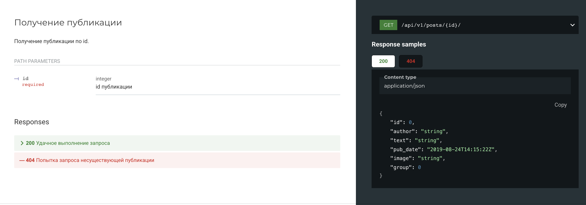
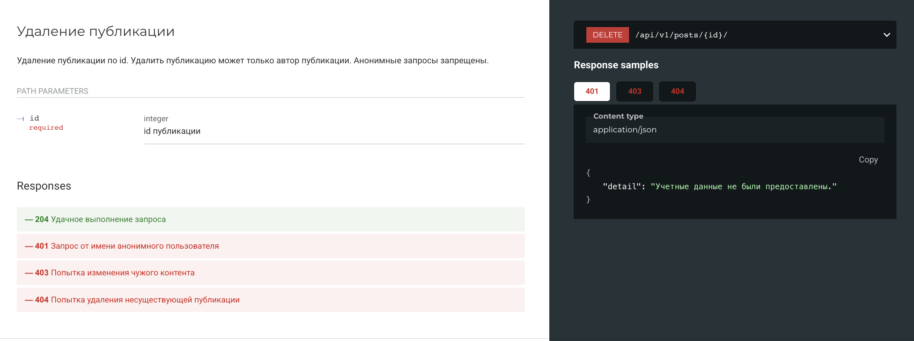
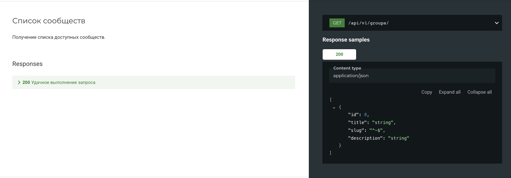
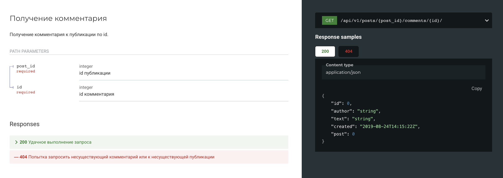

# API Yatube

## Описание
Yatube — это социальная платформа, где пользователи могут делиться своими мыслями, публикуя посты, комментировать записи других участников и подписываться на любимых авторов. Документация API доступна по адресу `http://127.0.0.1:8000/redoc/`.

## Установка
1. Клонируйте репозиторий:
   ```bash
   git clone https://github.com/pluplohapy/api_final_yatube.git
   cd api_final_yatube
   ```
2. Создайте и активируйте виртуальное окружение:
   ```bash
   python3 -m venv env
   source env/bin/activate
   ```
3. Установите зависимости:
   ```bash
   python3 -m pip install --upgrade pip
   pip install -r requirements.txt
   ```
4. Выполните миграции:
   ```bash
   python3 manage.py migrate
   ```
5. Запустите сервер:
   ```bash
   python3 manage.py runserver
   ```

## Примеры
- **Получение публикации**

- **Удаление публикации**

- **Список сообществ**

- **Получение комментария**
